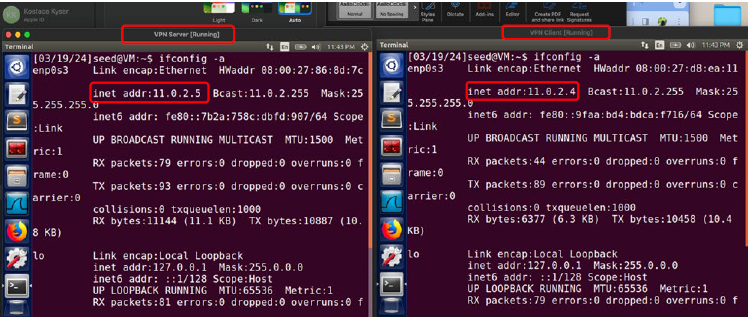
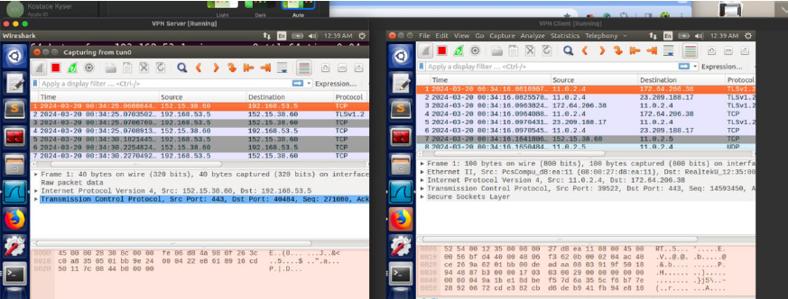

# VPN and Tunneling Network Security Lab

## Project Overview
This project demonstrates VPN tunneling concepts using virtual machines, TUN/TAP interfaces, and Wireshark packet analysis.

## Skills Demonstrated
- VPN tunneling concepts
- Network-layer security
- Packet capture and analysis
- Wireshark traffic inspection
- Secure communication risk analysis

## Security Problem
Private network communication can expose traffic if not properly tunneled or protected.

## Lab Implementation
- Configured VPN client and server virtual machines
- Verified network connectivity
- Captured traffic using Wireshark
- Analyzed encapsulated packets and tunneling behavior

## Risk / Control Mapping
| Risk | Control |
|---|---|
| Exposed network traffic | VPN tunneling |
| Unauthorized network access | Controlled tunnel endpoints |
| Poor visibility | Packet capture and monitoring |

## Screenshots

## GRC Relevance
This project demonstrates how VPNs support secure communications, access control, monitoring, and network segmentation.
